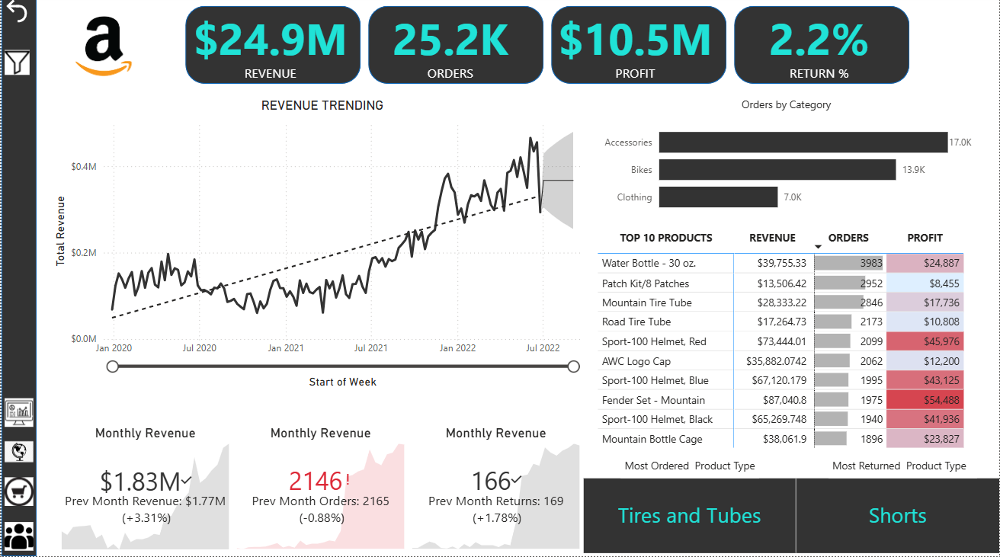

# 📊 Sales Analysis Dashboard


---

# 📑 Table of Contents
- [Project Overview](#project-overview)
- [Business Problem](#business-problem)
- [Dataset](#dataset)
- [Tools & Technologies](#tools--technologies)
- [Dashboard Features](#dashboard-features)
- [Dashboard Preview](#dashboard-preview)
- [Key Insights](#key-insights)
- [Project Structure](#project-structure)
- [How to Use](#how-to-use)
- [Future Improvements](#future-improvements)
- [Author](#author)

---

# Project Overview
This project presents an **interactive Power BI dashboard** designed to analyze sales performance across different regions and product categories.

The dashboard provides insights into:
- Sales trends
- Product performance
- Regional sales distribution
- Customer purchasing behavior

---

# Business Problem
Organizations often struggle to monitor sales performance across multiple dimensions.  
This project builds a dashboard to **track KPIs and provide actionable insights for decision making.**

---

# Dataset
The dataset includes:

- Customer lookup
- Calendar lookup
- Product category lookup  
- Product lookup
- Territory
- Sales data  
- Returns data
- Product subcategory lookup  

The data was cleaned and transformed before visualization.

---

# Tools & Technologies
- **Power BI**
- **Excel / CSV**
- **GitHub**

---

# Dashboard Features
The dashboard includes:

- 📈 Sales Trend Analysis  
- 🌎 Regional Sales Distribution  
- 🛍 Top Selling Products  
- 📦 Product Category Performance  
- 👥 Customer Segment Analysis  

Users can filter by **region, category, and time period**.

---

# Dashboard Preview



---

# Key Insights
- Some regions contribute significantly more revenue.
- A few products drive most of the sales.
- Seasonal trends appear in monthly sales.
- Customer segments show different buying patterns.

---

# Project Structure
```
sales-analysis-project
│
├── 01-data
│   ├── lookups
│   │   ├── customer_lookup.csv
│   │   ├── calendar_lookup.csv
│   │   ├── product_lookup.csv
│   │   ├── product_category_lookup.csv
│   │   ├── product_subcategory_lookup.csv
│   │   └── territory_lookup.csv
│   │
│   ├── facts
│   │   ├── sales_data.csv
│   │   └── returns_data.csv
│
├── 02-dashboard
│   └── sales_dashboard.pbix
│
├── 03-images
│   └── dashboard_preview.png
│
└── README.md
```
---

# How to Use
1. Download the `.pbix` file.
2. Open using **Power BI Desktop**.
3. Interact with filters and explore insights.

---

# Future Improvements
- Add predictive sales forecasting
- Integrate real-time data
- Add customer lifetime value analysis

---

# Author
- Rajat Pradhan
- email: rajat20pradhan@gmail.com
- **Data Analyst Portfolio Project**

⭐ If you found this project useful, please consider starring the repository.
